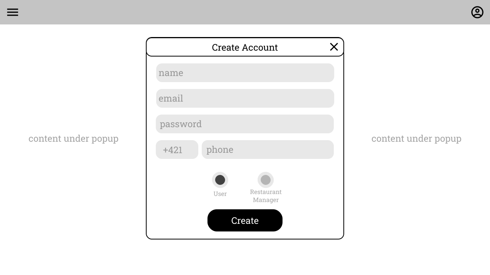
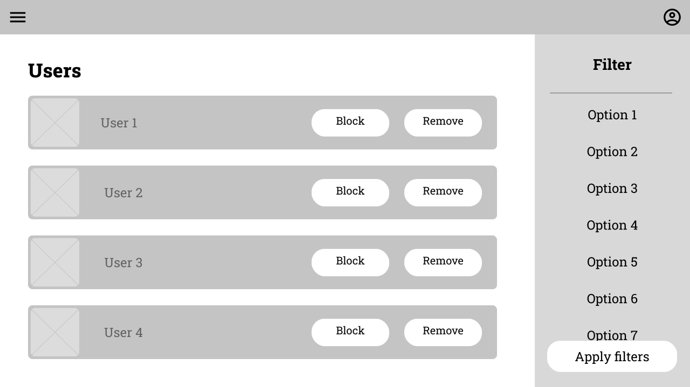

# Vývoj aplikácii s viacvrstvovou architektúrou

## Semestrálny projekt - projektová dokumentácia

[Backend](https://github.com/vktr274/vava-backend) a [frontend](https://github.com/vktr274/vava-frontend) sú v oddelených repozitároch [vktr274/vava-frontend](https://github.com/vktr274/vava-frontend) a [vktr274/vava-backend](https://github.com/vktr274/vava-backend).

### RACI matica

*placeholder*

### Vízia

Aplikácia GYM - Get Your Meal slúži ako platforma na zjednotenie objednávacích služieb do jednej aplikácie. Zákazníci budú môcť využiť GYM na objednanie jedla z akejkoľvek reštaurácie, služba GYM vybaví vašu objednávku za vás. Služba má za cieľom ponúknuť príjemný používateľský zážitok, čím priláka veľký počet zákazníkov.

### Využitie

V súčasnej dobe rastú požiadavky na donášku jedla od používateľov. Veľmi často sa stáva, že už existujúce aplikácie majú v nejakom momente nedostatok dostupných kuriérov, prípadne sú inak preťažené. Z tohto dôvodu nie je podobných služieb dostatok, pokým sa nedá aspoň z jednej jedlo objednať a aplikácia GYM mieri presne na túto dieru na trhu - ďalšia donášková služba z pohodlia aplikácie bez toho, aby používateľ musel neúmerne dlho čakať na donášku z dôvodu, že si nikde nemôže objednať jedlo, lebo sú ostatné služby často preťažené a nefunkčné.

### Zoznam aktérov

#### Zákazník

Ondrej veľa pracuje v office a nemá veľa času aby išiel niekam von na obed. Preto, pre neho, aby ušetril svoj vzácny voľný čas, je výhodné použitie aplikácie, ktorá umožňuje objednávku jedla z akejkoľvek reštaurácie, alebo kaviarne v jeho okolí. Takto nemusí tráviť čas cestou na obed a späť, ale iba si vytvorí objednávku a k prestávke dostane svoje jedlo.

#### Správca reštaurácie

Lucia, ako manažérka reštaurácie, sa rozhodla zaregistrovať reštauráciu v aplikácií. Pridá sem jedlo, ktoré pripravujú, nejaké fotografie, popis a cenu k nemu. Ak sa v budúcnosti rozhodnú pridať nové jedlo do menu, alebo vymazať staré, keďže ho už nevaria, vie to zmeniť aj v aplikácií. Takto obsah zostane relevantný a reštaurácia bude mať dostatok objednávok.

#### Administrátor

Filip je administrátor aplikácie. Jeho úlohou je pozorovať aktivitu používateľov a reštaurácií, ktoré sú v aplikácií. Ak nejaký používateľ píše nevhodné komentáre, alebo ak nejaká reštaurácia dostáva príliš zlé hodnotenie, tak vie ich účet zablokovať, a už nebudú mať prístup k programu.

### Používateľský jazyk

#### Reštaurácia/prevádzka - externá spoločnosť s ponukou jedál na objednávku

a) Čím viac reštaurácií sa nachádza v aplikácii, tým väčší výber pre používateľa a väčšia pravdepodobnosť, že si vyberie.
b) Prítomnosť reštaurácií v aplikácii je nevyhnutná, ba až kľúčová.
c) Pre každú reštauráciu je uvedená cena donášky z konkrétnej reštaurácie.
d) Každá reštaurácia má zobrazené užívateľské hodnotenia.

#### Menu - ponuka jedál v rámci reštaurácie

a) každá reštaurácia má svoju vlastnú ponuku jedál, ktorá je pre každú reštauráciu nevyhnutná.
b) Každé jedlo obsahuje aj krátky popis s použitými ingredienciami.
c) Pre každú položku je uvedená cena.

#### Objednávka - vybrané položky, ktoré chce používateľ kúpiť

a) Jednoznačne definovaný zoznam jedál, ktoré si používateľ objednáva.
b) Musí byť z reštaurácií, ktoré sú istú maximálnu vzdialenosť od seba z logistických dôvodov.
c) Obsahuje aj poznámky ku objednávke - nie sú vyžadované, ani potrebné, ale v niektorých situáciách môžu uľahčiť používanie.

#### Platba objednávky - platba za jedlo, ktoré používateľ objednáva

a) Nutný výber spôsobu platby za objednávku kartou alebo v hotovosti.

#### Donáška - doručenie objednávky zákazníkovi

a) Používateľovi je zobrazený predpokladaný čas trvania donášky.

#### Adresa doručenia - adresa, kam kuriér doručí zákazníkovi objednávku

a) Zadáva ju zákazník v rámci objednávky.
b) Je nevyhnutná pre doručenie objednávky.
c) Vplýva na cenu doručenia.

### Najbežnejšie úlohy

#### Objednávka jedla z vybranej prevádzky zákazníkom

Ondrej práve prišiel domov z dennej zmeny a zistil, že si predchádzajúci deň zabudol navariť. Rozhodne sa teda využiť služby GYM, prihlási sa a začne vyhľadávať reštaurácie ponúkajúce burgre. Po nájdení vyhovujúcej reštaurácie pridá do košíka dvojitý cheeseburger a pokračuje k objednávke. Keďže už mal účet, sú uložené jeho fakturačné údaje, preto vyberá len platobnú metódu. Z platby online a platby na dobierku vyberá platbu online a dokončuje objednávku.

#### Pridanie recenzie na jedlo z vybranej prevádzky

Keďže bol Ondrej spokojný s reštauráciou, rozhodol sa ju ohodnotiť. Otvorí si predchádzajúce objednávky a pri danej objednávke použije tlačidlo na pridanie recenzie. K recenzii pridá hodnotenie z 10 bodov, fotky a text recenie, recenziu uloží a je viditeľná pre verejnosť.

#### Pridanie prevádzky jej správcom

Lucia pôsobí ako manažérka v novovzniknutej reštaurácii a dostala pokyn na zverejnenie jej ponuky v aplikácii GYM. Lucia vytvorí pre reštauráciu v GYM konto, pridá k nej názov, popis, adresu, menu s cenníkom, ktoré potom zverejní ostatným používateľom.

#### Zablokovanie používateľa administrátorom aplikácie

Filipovi prišla notifikácia, že istý používateľ porušil pravidlá používania aplikácie, preto musí hneď konať. Prihlási sa ako administrátor vyhľadá daného používateľa a zablokuje mu účet. Danému používateľovi následne príde automaticky vygenerovaný e-mail upozorňujúci na jeho zablokovanie.

#### Zablokovanie reštaurácie administrátorom aplikácie

Filip zistí, že jedna z reštaurácii zanikla, preto ju už nie je potrebné v aplikácii ponúkať. Filip sa prihlási ako administrátor, vyhľadá danú reštauráciu a zablokuje jej konto a následne príde bývalému manažérovi reštaurácie automaticky vygenerovaný e-mail o zablokovaní účtu.

### Hlavné procesy

<b>Rozbaliť schému hlavných procesov</b>

### Nefunkčné požiadavky

Keďže trh s donáškovými aplikáciami je na mobilných zariadeniach dostatočne presýtený, GYM je zameraný na použitie na desktope/laptope - používateľ si vie objednať jedlo počas práce na desktope/laptope bez toho, aby musel prerušiť kontakt s desktopom/laptopom.

### Schéma databázy

<b>Rozbaliť schému databázy</b>

### Navigácia - Sitemap

<b>Rozbaliť schému navigácie</b>

### Use Case - Zákazník

<b>Rozbaliť use case diagram pre zákazníka</b>

### Use Case - Správca reštaurácie

<b>Rozbaliť use case diagram pre správcu reštaurácie</b>

### Use Case - Administrátor

<b>Rozbaliť use case diagram pre administrátora</b>

### Wireframes

<b>1. Domovská obrazovka</b>

<b>2. Obrazovka pre prihlasovanie</b>

<b>3. Obrazovka pre registráciu používateľa</b>

<b>4. Obrazovka pre registráciu reštaurácie</b>

<b>5. Obrazovka nastavení účtu</b>

<b>6. Obrazovka pre správu reštaurácie jej správcom</b>

<b>7. Obrazovka pre správu reštaurácií administrátorom</b>

<b>8. Obrazovka pre správu používateľov administrátorom</b>

<b>9. Obrazovka ponuky reštaurácií</b>

<b>10. Obrazovka reštaurácie</b>

<b>11. Obrazovka pre zhrnutie objednávky</b>

<b>12. Obrazovka pre pridanie recenzie</b>

<b>13. Obrazovka nastavení</b>

