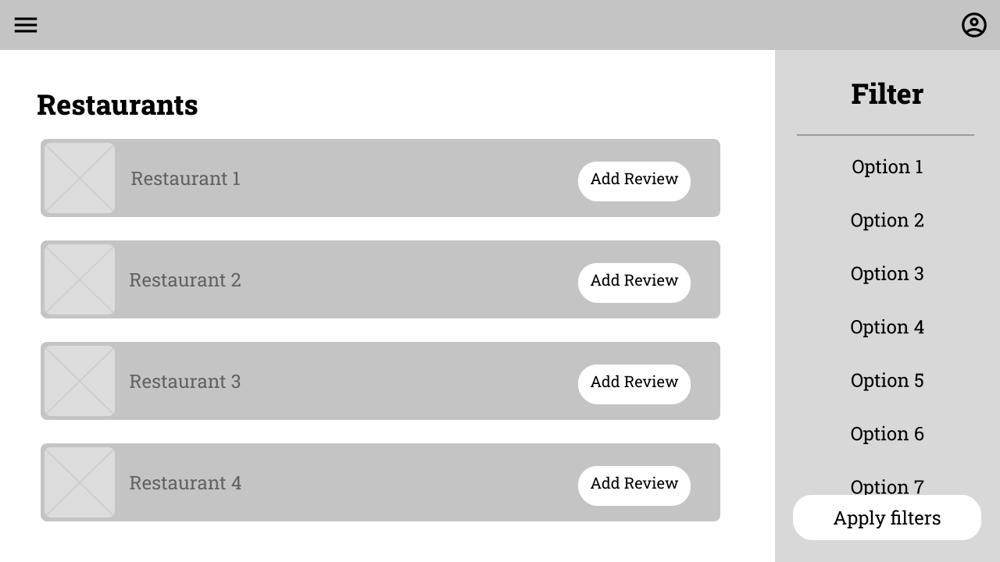

# Projektová dokumentácia pre GYM - Get Your Meal

**Tím Žalospeváci**:\
András Nagy, Ján Herceg, Mykyta Kretinin, Viktor Modroczký, Peter Janoš

Dokumentácia obsahuje [projektový zámer](#projektový-zámer) aj [finálny popis aplikácie](#finálna-dokumentácia).

Videoprezentácia je nahraná na YouTube na tomto [linku](https://youtu.be/af5oA9q60Uk).

[Backend](https://github.com/vktr274/vava-backend) a [frontend](https://github.com/vktr274/vava-frontend) s popisom sú v oddelených repozitároch [vktr274/vava-frontend](https://github.com/vktr274/vava-frontend) a [vktr274/vava-backend](https://github.com/vktr274/vava-backend).

## Projektový zámer

### RACI matica
| | András Nagy | Ján Herceg | Mykyta Kretinin | Viktor Modroczký | Peter Janoš |
| --- | --- | --- | --- | --- | --- |
| GUI | I | RA | I | C | R |
| Wireframes | I | RA | R | R | I |
| REST API | I | IA | R | R | I |
| Schéma DB | R | IA | C | R | I |
| Implementácia ORM | I | IA | R | R | I |
| Diagramy[1](#footnote) | R | IA | I | I | I |
| Logovanie | R | IA | I | I | C |
| Validácia vstupov a RegEx | R | CA | R | C | R |
| Lokalizácia | I | RA | I | I | R |
| XML | C | RA | C | C | I |

**Vysvetlivky**

`A` - Approval

`R` - Realization

`C` - Consultation

`I` - Information

[1](#diagrams) Sequence, Class, Package, Activity, Use Case diagramy

### Vízia

Aplikácia GYM - Get Your Meal slúži ako platforma na zjednotenie objednávacích služieb do jednej aplikácie. Zákazníci budú môcť využiť GYM na objednanie jedla z akejkoľvek reštaurácie, služba GYM vybaví vašu objednávku za vás. Služba má za cieľom ponúknuť príjemný používateľský zážitok, čím priláka veľký počet zákazníkov.

### Využitie

V súčasnej dobe rastú požiadavky na donášku jedla od používateľov. Veľmi často sa stáva, že už existujúce aplikácie majú v nejakom momente nedostatok dostupných kuriérov, prípadne sú inak preťažené. Z tohto dôvodu nie je podobných služieb dostatok, pokým sa nedá aspoň z jednej jedlo objednať a aplikácia GYM mieri presne na túto dieru na trhu - ďalšia donášková služba z pohodlia aplikácie bez toho, aby používateľ musel neúmerne dlho čakať na donášku z dôvodu, že si nikde nemôže objednať jedlo, lebo sú ostatné služby často preťažené a nefunkčné.

### Zoznam aktérov

#### Zákazník

a) Vie si vytvoriť konto a prihlasovať sa.

b) Objednáva jedlo z akejkoľvek reštaurácie alebo kaviarne dostupnej v jeho okolí.

c) Vie pridávať hodnotenia na reštaurácie.

**Príklad**:
Ondrej veľa pracuje v office a nemá veľa času aby išiel niekam von na obed. Preto, pre neho, aby ušetril svoj vzácny voľný čas, je výhodné použitie aplikácie, ktorá umožňuje objednávku jedla z akejkoľvek reštaurácie, alebo kaviarne v jeho okolí. Takto nemusí tráviť čas cestou na obed a späť, ale iba si vytvorí objednávku a k prestávke dostane svoje jedlo.

#### Správca reštaurácie

a) Registruje reštauráciu.

b) Pre zaregistrovanú reštauráciu pridáva jedlo, fotografie k jedlu, popis a cenu.

c) Udržuje aktuálny a relevantný zoznam ponúkaných položiek.

**Príklad**:
Lucia, ako manažérka reštaurácie, sa rozhodla zaregistrovať reštauráciu v aplikácií. Pridá sem jedlo, ktoré pripravujú, nejaké fotografie, popis a cenu k nemu. Ak sa v budúcnosti rozhodnú pridať nové jedlo do menu, alebo vymazať staré, keďže ho už nevaria, vie to zmeniť aj v aplikácií. Takto obsah zostane relevantný a reštaurácia bude mať dostatok objednávok.

#### Administrátor

a) Kontroluje aktivitu reštaurácií a používateľov.

b) Pri nevhodnom používaní aplikácie má právomoc zablokovať alebo vymazať daný účet.

**Príklad**:
Filip je administrátor aplikácie. Jeho úlohou je pozorovať aktivitu používateľov a reštaurácií, ktoré sú v aplikácií. Ak nejaký používateľ píše nevhodné komentáre, alebo ak nejaká reštaurácia dostáva príliš zlé hodnotenie, tak vie ich účet zablokovať, a už nebudú mať prístup k programu.

### Používateľský jazyk

#### Reštaurácia/prevádzka - externá spoločnosť s ponukou jedál na objednávku

a) Čím viac reštaurácií sa nachádza v aplikácii, tým väčší výber pre používateľa a väčšia pravdepodobnosť, že si vyberie.

b) Prítomnosť reštaurácií v aplikácii je nevyhnutná, ba až kľúčová.

c) Pre každú reštauráciu je uvedená cena donášky z konkrétnej reštaurácie.

d) Každá reštaurácia má zobrazené užívateľské hodnotenia.

#### Menu - ponuka jedál v rámci reštaurácie

a) každá reštaurácia má svoju vlastnú ponuku jedál, ktorá je pre každú reštauráciu nevyhnutná.

b) Každé jedlo obsahuje aj krátky popis s použitými ingredienciami.

c) Pre každú položku je uvedená cena.

#### Objednávka - vybrané položky, ktoré chce používateľ kúpiť

a) Jednoznačne definovaný zoznam jedál, ktoré si používateľ objednáva.

b) Musí byť z reštaurácií, ktoré sú istú maximálnu vzdialenosť od seba z logistických dôvodov.

c) Obsahuje aj poznámky ku objednávke - nie sú vyžadované, ani potrebné, ale v niektorých situáciách môžu uľahčiť používanie.

#### Platba objednávky - platba za jedlo, ktoré používateľ objednáva

Nutný výber spôsobu platby za objednávku kartou alebo v hotovosti.

#### Donáška - doručenie objednávky zákazníkovi

Používateľovi je zobrazený predpokladaný čas trvania donášky.

#### Adresa doručenia - adresa, kam kuriér doručí zákazníkovi objednávku

a) Zadáva ju zákazník v rámci objednávky.

b) Je nevyhnutná pre doručenie objednávky.

c) Vplýva na cenu doručenia.

### Najbežnejšie úlohy

#### Objednávka jedla z vybranej prevádzky zákazníkom

Ondrej práve prišiel domov z dennej zmeny a zistil, že si predchádzajúci deň zabudol navariť. Rozhodne sa teda využiť služby GYM, prihlási sa a začne vyhľadávať reštaurácie ponúkajúce burgre. Po nájdení vyhovujúcej reštaurácie pridá do košíka dvojitý cheeseburger a pokračuje k objednávke. Keďže už mal účet, sú uložené jeho fakturačné údaje, preto vyberá len platobnú metódu. Z platby online a platby na dobierku vyberá platbu online a dokončuje objednávku.

#### Pridanie recenzie na jedlo z vybranej prevádzky

Keďže bol Ondrej spokojný s reštauráciou, rozhodol sa ju ohodnotiť. Otvorí si predchádzajúce objednávky a pri danej objednávke použije tlačidlo na pridanie recenzie. K recenzii pridá hodnotenie z 10 bodov, fotky a text recenie, recenziu uloží a je viditeľná pre verejnosť.

#### Pridanie prevádzky jej správcom

Lucia pôsobí ako manažérka v novovzniknutej reštaurácii a dostala pokyn na zverejnenie jej ponuky v aplikácii GYM. Lucia vytvorí pre reštauráciu v GYM konto, pridá k nej názov, popis, adresu, menu s cenníkom, ktoré potom zverejní ostatným používateľom.

#### Zablokovanie používateľa administrátorom aplikácie

Filipovi prišla notifikácia, že istý používateľ porušil pravidlá používania aplikácie, preto musí hneď konať. Prihlási sa ako administrátor vyhľadá daného používateľa a zablokuje mu účet. Danému používateľovi následne príde automaticky vygenerovaný e-mail upozorňujúci na jeho zablokovanie.

#### Zablokovanie reštaurácie administrátorom aplikácie

Filip zistí, že jedna z reštaurácii zanikla, preto ju už nie je potrebné v aplikácii ponúkať. Filip sa prihlási ako administrátor, vyhľadá danú reštauráciu a zablokuje jej konto a následne príde bývalému manažérovi reštaurácie automaticky vygenerovaný e-mail o zablokovaní účtu.

### Hlavné procesy

<b>Rozbaliť schému hlavných procesov</b>

### Nefunkčné požiadavky

Keďže trh s donáškovými aplikáciami je na mobilných zariadeniach dostatočne presýtený, GYM je zameraný na použitie na desktope/laptope - používateľ si vie objednať jedlo počas práce na desktope/laptope bez toho, aby musel prerušiť kontakt s desktopom/laptopom.

### Schéma databázy

#### Pôvodná schéma databázy

<b>Rozbaliť schému databázy</b>

#### Finálna schéma databázy

<b>Rozbaliť finálnu schému databázy</b>

### Navigácia - Sitemap

<b>Rozbaliť schému navigácie</b>

### Use Case - Zákazník

<b>Rozbaliť use case diagram pre zákazníka</b>

### Use Case - Správca reštaurácie

<b>Rozbaliť use case diagram pre správcu reštaurácie</b>

### Use Case - Administrátor

<b>Rozbaliť use case diagram pre administrátora</b>

### Wireframes

<b>1. Domovská obrazovka</b>

<b>2. Obrazovka pre prihlasovanie</b>

<b>3. Obrazovka pre registráciu používateľa</b>

<b>4. Obrazovka pre registráciu reštaurácie</b>

<b>5. Obrazovka nastavení účtu</b>

<b>6. Obrazovka pre správu reštaurácie jej správcom</b>

<b>7. Obrazovka pre správu reštaurácií administrátorom</b>

<b>8. Obrazovka pre správu používateľov administrátorom</b>

<b>9. Obrazovka ponuky reštaurácií</b>

<b>10. Obrazovka reštaurácie</b>

<b>11. Obrazovka pre zhrnutie objednávky</b>

<b>12. Obrazovka pre pridanie recenzie</b>

<b>13. Obrazovka nastavení</b>

## Finálna dokumentácia

### Realizácia požiadaviek

#### Kolekcie

Pri vytvorení projektu boli použité rôzne dátové štruktúry pre uchovávanie dát. Najčastejšou používanou dátovou štruktúrou je ArrayList, keďže je dynamický a nemusíme ho realokovať pri pridavaní/vymazávaní dát. Používame ho namiesto LinkedList, pretože dáta v ArrayList na backende nemeníme často a potrebujeme k rýchlejší prístup na čítanie, čo je výhodou tejto dátovej štruktúry. Okrem toho sa pre výmenu dát medzi frontendom a backendom používa dátový formát JSON pre serializovanie dátových štruktúr - objekty a polia.

#### Logovanie

Logovanie sa uskutočňuje na backendovej časti projektu, kde beží server s endpointami. Do logov sa zapisujú všetky zachytené výnimky (exceptions), vytváranie, zmena a vymazanie údajov v databáze, úspešné či neúspešné prihlásenie sa používateľa do aplikácie, pokus o neoprávnený prístup k dátam (nesprávna rola).

#### Lokalizácia

Aplikácia beží v dvoch jazykoch: angličtina a slovenčina. Používateľ vie zmeniť jazyk cez tlačidlo *Jazyk - EN*, resp. *Language - EN* v bočnom menu.

#### XML

Frontend je napísaný s použitím JavaFX a základné rozhranie okien aplikácie bolo vytvorené v FXML súboroch. FXML súbory sa načítavajú cez FXMLLoader. FXML jazyk, ktorý je založený na XML, sa používal pre vytvorenie dizajnu aplikácie a polohovanie komponentov GUI. Neskôr tieto komponenty sa dopĺňali a menili v kóde.

#### Regulárne výrazy - RegEx

Regulárne výrazy boli použité na backendovej a frontendovej časti pre validáciu dát. Na frontende sa používajú napríklad pre overenie či používateľ zadal správny formát emailu pri registrácii a či je zadané heslo dostatočne zložité (8+ znakov, 1 veľké a 1 malé písmeno, 1 špeciálny znak). Na backende sa RegEx používa pre validáciu dát modelu Phone - country code ("+ a 3 číslice") a telefónneho čísla (zvyšných 9 číslic).

#### JDBC

V projekte sa na uchovavánie dát používa PostgreSQL databáza. Pripojenie k databáze bolo realizované pomocou Spring v súbore application.properties, v ktorom sa odkazuje na premenné prostredia obsahujúce datasurce url, heslo a používateľské meno pre pripojenie k DB. Komunikácia s databázou sa uskutočňovala s využitím Spring Data JPA nad JDBC a Hibernate. Pre jednoduchosť práce s dátami boli vytvorené modely reprezentujuce dáta tabuliek DB. Štruktúra databázy sa aktualizuje cez migrácie, ktoré sú súčasťou backendu a overujú, resp. aplikujú sa pri spustení servera.

Premenné prostredia je nutné nastaviť v nasledovnom tvare:

`SPRING_DATASOURCE_URL=jdbc:postgresql://{your_host}:{your_port}/{your_db_name}?currentSchema={your_schema_name}`\
`SPRING_DATASOURCE_USERNAME={your_username}`\
`SPRING_DATASOURCE_PASSWORD={your_password}`,

kde `{your_host}`, `{your_port}`, `{your_db_name}` a `your_schema_name` treba nahradiť údajmi PostgreSQL databázy.

#### Ošetrenie/validácia vstupov + bezpečnosť

Ako už bolo spomenuté, na frontende a backende sa ošetruje formát dát pre isté vstupy. Zároveň sa v aplikácií používajú tokeny pri komunikácii klienta so serverom. Token sa generuje pre usera pri prihlásení do aplikácie (1 token per session) a odosiela sa v headeri HTTP requestov. Backend potom overuje či majiteľ tohto tokenu ma oprávnenie (rolu) vykonať istú operáciu, a ak áno, môže pokračovať. Neoprávnený prístup, zlý formát dát, zlé requesty a iné chyby sa zachytávajú na backende a zapisujú do logov. Všetky operácie s databázou sú vykonávané cez metódy rozhraní (interface) repozitárov (repositories) poskytované Spring Data JPA, ktoré súvisia s modelmi ORM Hibernate a sú SQL Injection Safe. Zároveň sa v kóde používa anotácia @Query pre vytvorenie native query, ktoré sú tiež SQL Injection Safe, keďže sa nepoužíva obyčajné spájanie reťazcov - concatenation. Frontend šifruje heslo do MD5 pri registrácii používateľa, aby sa do databázy neukladalo heslo v ako "raw" text.

#### GUI

Frontend aplikácia je napísaný s použitím JavaFX.

#### Traja rôzni používatelia

Aplikácia je navrhnutá pre 3 typy (roly) používateľov: guest (prihlásený zákazník), manager (manažér reštaurácie) a admin. Každá rola má svoje oprávnenia a pri použití aplikácie sa jej zobrazujú len jej prístupné prvky stránky. Na backende sa rola používa pre overovanie prístupu používateľov k dátam cez API volania.

#### Zapuzdrenie dátových zložiek

Všetky dátové zložky sú privátne a prístup k nim funguje prostredníctvom zodpovedajúcich getterov a setterov.

### Diagramy

Diagramy boli vytvorené pomocou modelovacieho nástroja Enterprise Architect. Projektový súbor je [GYM.eap](GYM.eap).

#### Diagramy aktivít

<b>Rozbaliť diagram aktivít administrátora</b>

<b>Rozbaliť diagram aktivít manažéra reštaurácie</b>

<b>Rozbaliť diagram aktivít zákazníka</b>

#### Diagram tried

<b>Rozbaliť diagram tried</b>

#### Diagramy balíkov

<b>Rozbaliť diagram balíkov pre frontend</b>

<b>Rozbaliť diagram balíkov pre backend</b>

#### Sekvenčné diagramy

<b>Rozbaliť sekvenčný diagram administrátora</b>

<b>Rozbaliť sekvenčný diagram manažéra reštaurácie</b>

<b>Rozbaliť sekvenčný diagram zákazníka</b>

#### Diagramy prípadov použitia

<b>Rozbaliť diagram prípadov použitia pre administrátora</b>

<b>Rozbaliť diagram prípadov použitia pre manažéra reštaurácie</b>

<b>Rozbaliť diagram prípadov použitia pre zákazníka</b>

