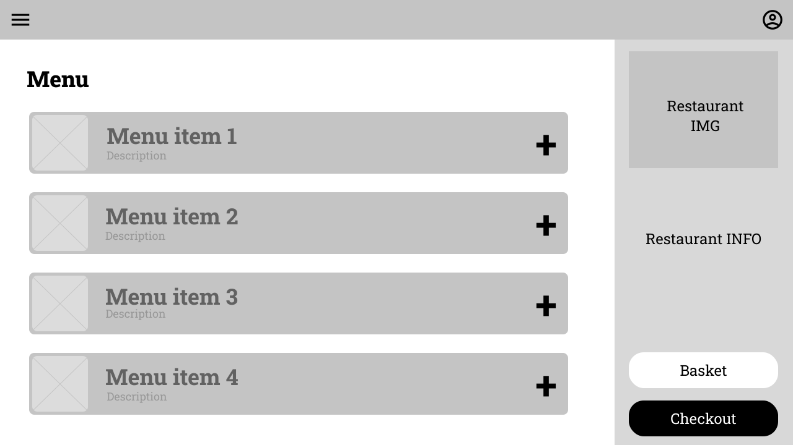

# Vývoj aplikácii s viacvrstvovou architektúrou

## Semestrálny projekt - projektová dokumentácia

[Backend](https://github.com/vktr274/vava-backend) a [frontend](https://github.com/vktr274/vava-frontend) sú v oddelených repozitároch [vktr274/vava-frontend](https://github.com/vktr274/vava-frontend) a [vktr274/vava-backend](https://github.com/vktr274/vava-backend).

### Schéma databázy

<b>Rozbaliť schému databázy</b>

### Navigácia - Sitemap

<b>Rozbaliť schému navigácie</b>

### Use Case - Zákazník

<b>Rozbaliť use case diagram pre zákazníka</b>

### Use Case - Správca reštaurácie

<b>Rozbaliť use case diagram pre správcu reštaurácie</b>

### Use Case - Administrátor

<b>Rozbaliť use case diagram pre administrátora</b>

### Wireframes

<b>1. Domovská obrazovka</b>

<b>2. Obrazovka pre prihlasovanie</b>

<b>3. Obrazovka pre registráciu používateľa</b>

<b>4. Obrazovka pre registráciu reštaurácie</b>

<b>5. Obrazovka nastavení účtu</b>

<b>6. Obrazovka pre správu reštaurácie jej správcom</b>

<b>7. Obrazovka pre správu reštaurácií administrátorom</b>

<b>8. Obrazovka pre správu používateľov administrátorom</b>

<b>9. Obrazovka ponuky reštaurácií</b>

<b>10. Obrazovka reštaurácie</b>

<b>11. Obrazovka pre zhrnutie objednávky</b>

<b>12. Obrazovka pre pridanie recenzie</b>

<b>13. Obrazovka nastavení</b>

