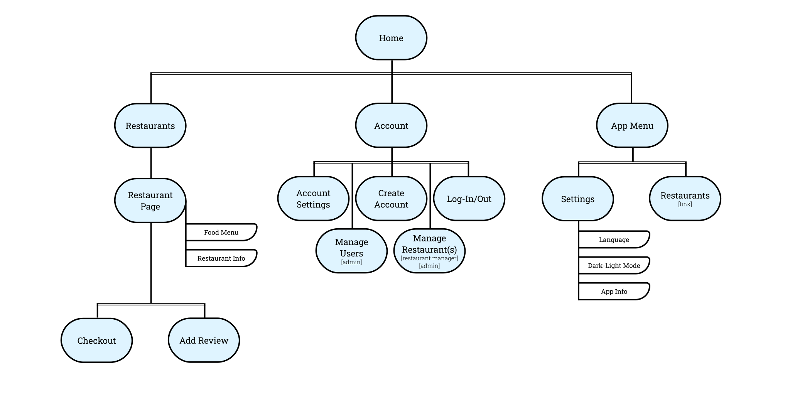

# Vývoj aplikácii s viacvrstvovou architektúrou

## Semestrálny projekt - projektová dokumentácia

[Backend](https://github.com/vktr274/vava-backend) a [frontend](https://github.com/vktr274/vava-frontend) sú v oddelených repozitároch [vktr274/vava-frontend](https://github.com/vktr274/vava-frontend) a [vktr274/vava-backend](https://github.com/vktr274/vava-backend).

### Schéma databázy

<b>Rozbaliť schému databázy</b>

### Navigácia - Sitemap

<b>Rozbaliť schému navigácie</b>

### Use Case - Zákazník

<b>Rozbaliť use case diagram pre zákazníka</b>

### Use Case - Správca reštaurácie

<b>Rozbaliť use case diagram pre správcu reštaurácie</b>

### Use Case - Administrátor

<b>Rozbaliť use case diagram pre administrátora</b>

